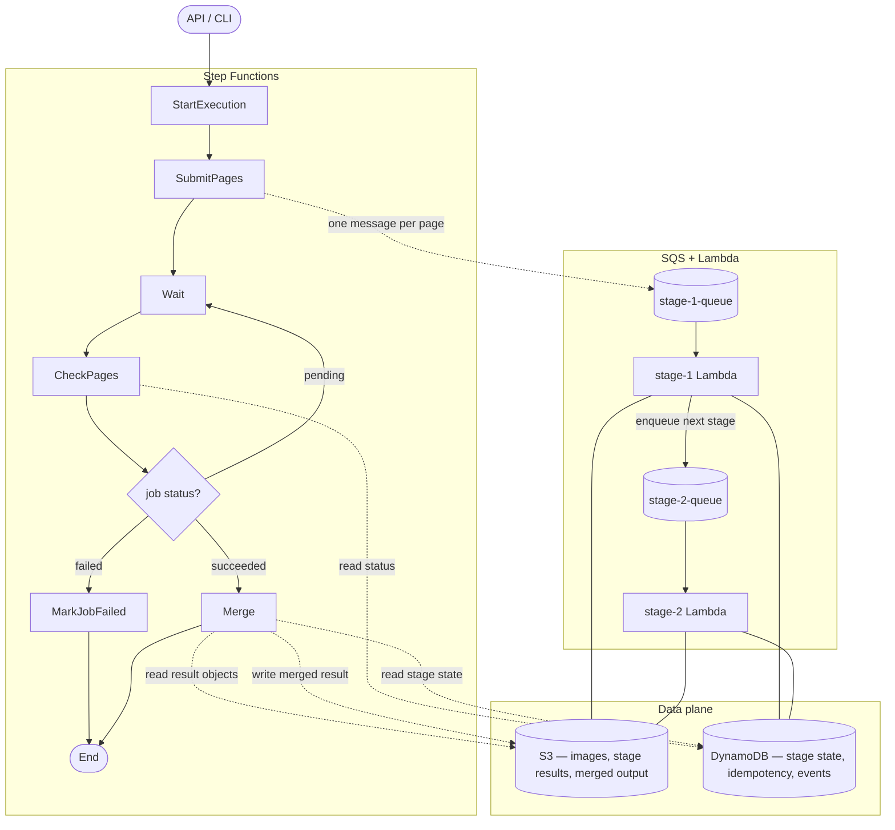

# Lady Glass
Lady Glass is a cloud OCR pipeline written in Go.

## Why Lady Glass
I met a Hong Kong woman in Kuala Lumpur who wore distinctive glasses.

After spending more than I should have, I later found myself reading PDFs, receipts, and card statements more carefully than usual.

At some point, I realized this was a job for AI, not for me.

Lady Glass is a pair of glasses for documents — her name was Miu.

## Architecture
Lady Glass uses Step Functions for document-level orchestration and SQS + Lambda for page-level AI execution. DynamoDB is the control plane. S3 is the data plane.



Step Functions owns the document workflow. SQS and Lambda own the per-page AI stage chain. They meet at DynamoDB, the control plane, and S3, the data plane.

| Layer          | Owns                                                             |
| -------------- | ---------------------------------------------------------------- |
| Step Functions | Per-document workflow: start, render, submit, wait, check, merge |
| SQS + Lambda   | Per-page AI stage chain: one queue + one Lambda per stage        |
| DynamoDB       | Stage state, idempotency keys, events — the control plane        |
| S3             | Page images, stage results, merged output — the data plane       |
| API Gateway    | Job control: upload URLs, execution start, status, and results   |


### Document workflow and page stages

Document-level operations such as render, submit, check, and merge are managed by Step Functions. Page-level stages such as AI extraction and normalization are executed by SQS and Lambda. DynamoDB records state and idempotency for both layers.

### Sources
Lady Glass can import documents from multiple sources.

Sources are treated as import stages. A source stage reads an external document and stores a fixed copy in the object store before the document enters the pipeline.

Examples of sources:

```text
local file
S3
Google Drive
OneDrive
```

After import, the rest of the pipeline works with the stored artifact URI.

### Current chain

The shipped chain for credit-card statements is two stages:

```text
gemini/v1                   → multimodal extraction; emits PageExtractionResult
normalize_card_statement/v1 → drops phantom schedule rows + zero-amount rows
                              (see internal/stage/normalize/cardstatement)
```

### Chain registry
A chain is a named processing plan. Multiple chains can coexist in the same Lady Glass deployment, such as `credit_card_statement_v1`, `receipt_v1`, or experimental chains.

When a job is created, the selected `ChainSpec` is resolved and frozen onto the `JobRecord`, so the job keeps following the chain it was born with even if the default chain changes later.

### Chain binding
A job is bound to the chain it was created with. The resolved `ChainSpec` is frozen onto the `JobRecord` ([SPEC §S10](SPEC.md#s10-chain-binding)), so new deployments can add or promote chains without disturbing in-flight jobs.

Old chain resources are kept for one retention window before removal — drain is the same 14-day window as everything else ([SPEC §S9](SPEC.md#s9-retention)).

Adding a stage to the *same* chain (currency conversion, classification, summary in the credit-card-statement chain) still costs only one SQS queue, one Lambda, and one `addStage` call per [SPEC §S7](SPEC.md#s7-composition).

### Why split this way
* **AI providers have different bottlenecks.** Each stage owns its own queue, so each Lambda sets its own reserved concurrency — a low-throughput provider cannot starve a high-throughput one.
* **Idempotency belongs at the stage level.** `job_id + page + stage + version` is the key. A redelivered SQS message, a Lambda retry, or a Step Functions re-execution all collapse to the same "succeeded → skip" path in DynamoDB.
* **Step Functions does not chain AI steps.** Page-level retry and ack stay inside SQS so workflow state transitions don't multiply with page count, and so external API limits don't leak into the workflow.
* **CheckPages is read-only.** It polls DynamoDB and either keeps waiting, merges, or fails the job. No work happens inside the workflow itself beyond orchestration.

### Idempotency

Lady Glass treats idempotency as part of the control plane.

Each page-level stage is keyed by:

```text
job_id + page + stage + version
```

Before a stage runs, DynamoDB is checked for the stage record. If the same stage has already succeeded, the external provider call is skipped and the stored artifact is reused.

This makes SQS redelivery, Lambda retry, and workflow retry safe: retries collapse to the same succeeded stage record instead of re-billing the same AI operation.

DynamoDB records are temporary execution state. Stage records, idempotency keys, and job events are written with TTL attributes; the retention window defines how long idempotency is guaranteed for completed jobs.

### Retention

Lady Glass is a workflow plane, not a system of record. DynamoDB rows and S3 artifacts expire after **14 days** ([SPEC §S9](SPEC.md#s9-retention)). The same window is used for stage idempotency, job state, artifacts, and chain-drain safety.

### Execution modes

Lady Glass supports two workflow modes selected per job at submission time.

In **passthrough** mode, the source PDF is sent to the AI stage as a single document input. Cheapest path, ideal for short PDFs (≤ ~5 pages) and images.

In **rendered** mode, a document-level RenderPages step splits the PDF into one-page PDFs first. SubmitPages then fans out one message per page to SQS, so the AI stage runs N times in parallel — true per-page parallelism, retry, and idempotency.

```bash
lady-glass submit ./statement.pdf                       # passthrough (default)
lady-glass submit ./long_report.pdf --mode rendered     # per-page split
```

## AWS Deploy
Lady Glass infrastructure is defined with AWS CDK.

Before the first deploy, provision two SSM parameters:

```bash
aws ssm put-parameter --type String --name /lady-glass/gemini-api-key \
  --value "<your Google AI Studio key>"
aws ssm put-parameter --type String --name /lady-glass/api-key \
  --value "$(openssl rand -hex 32)"
```

Then build the Go Lambda binaries and deploy:

```bash
./infra/cdk/build-lambdas.sh
cd infra/cdk && cdk deploy
```

This deploys the SQS, Lambda, DynamoDB, S3, API Gateway, and Step Functions resources used by the cloud pipeline. The stack outputs `ApiUrl`; put it and the API key into `.env` as `LADY_GLASS_API_URL` and `LADY_GLASS_API_TOKEN` so the CLI can reach the deployed stack.

## API

Lady Glass exposes five HTTP endpoints fronted by API Gateway. Auth is a shared `X-Api-Key` header. See [`internal/api/types.go`](internal/api/types.go) for the full request / response contract.

```text
POST /jobs                              open a job; returns a presigned upload URL
POST /jobs/{id}/start                   kick off the SFn workflow once uploaded
GET  /jobs/{id}                         status snapshot with per-page counts
GET  /jobs/{id}/result                  merged typed extraction (JSON)
GET  /jobs/{id}/aggregate?<filter>=<v>  single-dimension rollup (merchant=, foreign_currency=, …)
```

The `lady-glass` CLI wraps these endpoints — see Local Development below.

## Local Development
Lady Glass can run locally without AWS.

In local development, the same stage model is used with a file-based object store and an in-memory state store.


```bash
nix develop
go run ./cmd/lady-glass dev
```

The local runner uses mock AI stages and writes artifacts to `out/`.

## License
Lady Glass is licensed under the MIT License.  
Copyright (c) 2026 Kei Sawamura a.k.a. Master *void  
