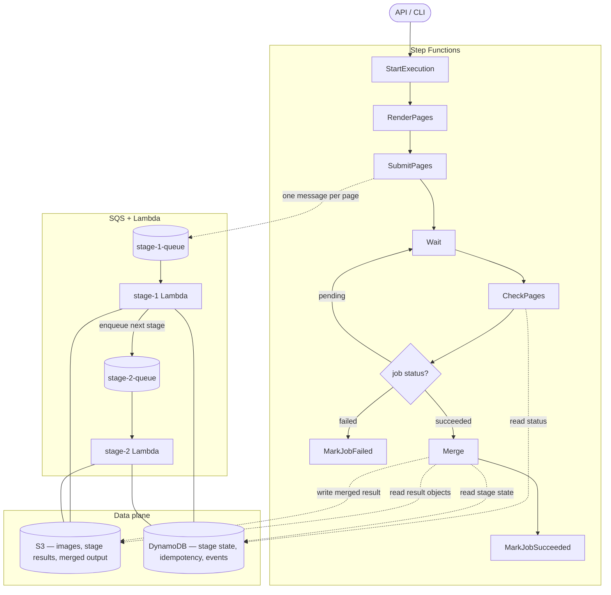

# Lady Glass
Lady Glass is a cloud OCR pipeline written in Go.

## Why Lady Glass
I met a Hong Kong woman in Kuala Lumpur who wore distinctive glasses.

After spending more than I should have, I later found myself reading PDFs, receipts, and card statements more carefully than usual.

At some point, I realized this was a job for AI, not for me.

Lady Glass is a pair of glasses for documents — her name was Miu.

## Architecture
Lady Glass uses Step Functions for document-level orchestration and SQS + Lambda for page-level AI execution. DynamoDB is the control plane. S3 is the data plane.



Step Functions owns the document workflow. SQS and Lambda own the per-page AI stage chain. They meet at DynamoDB, the control plane, and S3, the data plane.

| Layer          | Owns                                                             |
| -------------- | ---------------------------------------------------------------- |
| Step Functions | Per-document workflow: start, render, submit, wait, check, merge |
| SQS + Lambda   | Per-page AI stage chain: one queue + one Lambda per stage        |
| DynamoDB       | Stage state, idempotency keys, events — the control plane        |
| S3             | Page images, stage results, merged output — the data plane       |

### Every operation in Lady Glass is a stage
A stage is intentionally small: it receives one input, writes one output, and may enqueue the next stage.

It can be an OCR call, an AI extraction, a local transform, an import step, or a merge step. The executor treats them all the same.


### Sources

Lady Glass can import documents from multiple sources.

Sources are treated as import stages. A source stage reads an external document and stores a fixed copy in the object store before the document enters the pipeline.

Examples of sources:

```text
local file
S3
Google Drive
OneDrive
```

After import, the rest of the pipeline works with the stored artifact URI.

### Why split this way
* **AI providers have different bottlenecks.** Each stage owns its own queue, so each Lambda sets its own reserved concurrency — a low-throughput provider cannot starve a high-throughput one.
* **Idempotency belongs at the stage level.** `job_id + page + stage + version` is the key. A redelivered SQS message, a Lambda retry, or a Step Functions re-execution all collapse to the same "succeeded → skip" path in DynamoDB.
* **Step Functions does not chain AI steps.** Page-level retry and ack stay inside SQS so workflow state transitions don't multiply with page count, and so external API limits don't leak into the workflow.
* **CheckPages is read-only.** It polls DynamoDB and either keeps waiting, merges, or fails the job. No work happens inside the workflow itself beyond orchestration.

## Local Development
Lady Glass can run locally without AWS.

In local development, the same stage model is used with a file-based object store and an in-memory state store.


```bash
nix develop
go run ./cmd/lady-glass dev
```

The local runner uses mock AI stages and writes artifacts to `out/`.

## Current Status
Lady Glass is currently a work in progress.

The local mock pipeline is implemented. Cloud adapters and real AI stages will be added incrementally.

## License
Lady Glass is licensed under the MIT License.  
Copyright (c) 2026 Kei Sawamura a.k.a. Master *void  
