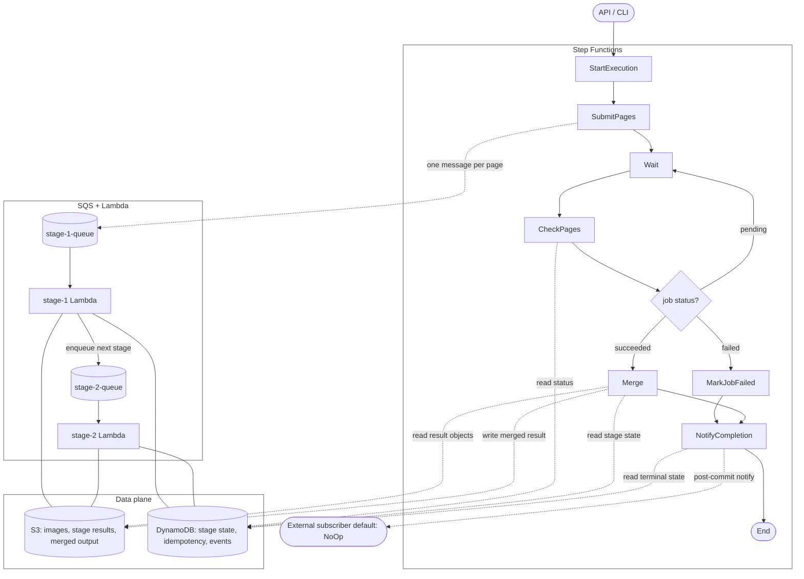

# Lady Glass

Lady Glass is a distributed document intelligence runtime for composing and executing versioned AI stage chains. AI reads. Lady Glass orchestrates.

## Why Lady Glass

In Kuala Lumpur, I met a Hong Kong woman who wore distinctive glasses.

After spending more than I should have, I later found myself reading PDFs, receipts, and card statements more carefully than usual.

At some point, I realized this was a job for AI, not for me.

Lady Glass is a pair of glasses for documents — her name was Miu.

## Architecture

Lady Glass uses Step Functions for document-level orchestration and SQS + Lambda for page-level AI execution. DynamoDB is the control plane. S3 is the data plane.



Step Functions owns the document workflow. SQS and Lambda own the per-page AI stage chain. They meet at DynamoDB, the control plane, and S3, the data plane.

| Layer          | Owns                                                             |
| -------------- | ---------------------------------------------------------------- |
| Step Functions | Per-document workflow: start, render, submit, wait, check, merge |
| SQS + Lambda   | Per-page AI stage chain: one queue + one Lambda per stage        |
| DynamoDB       | Stage state, idempotency keys, events — the control plane        |
| S3             | Page images, stage results, merged output — the data plane       |
| API Gateway    | Job control: upload URLs, execution start, status, and results   |

## Multi-Chain Stage Runtime

A chain is a named processing plan composed of page-level stages. Each stage owns its own SQS queue, Lambda function, concurrency limit, and versioned idempotency key.

Multiple chains can coexist in one deployment, such as `credit_card_statement_v1`, `receipt_v1`, and experimental chains.

Each job is bound to a versioned chain, so deployments do not affect in-flight jobs.

The shipped credit-card statement chain is:

```text
gemini/v1                    → multimodal extraction
normalize_card_statement/v1  → removes phantom schedule and zero-amount rows
```

Adding a stage requires one SQS queue, one Lambda, and one `addStage` call ([SPEC §S7](SPEC.md#s7-composition)).

### Idempotency

Each page-level stage is keyed by:

```text
job_id + page + stage + version
```

`chain_id` is unnecessary because each job is permanently bound to one chain; `(stage, version)` identifies the stage implementation.

A succeeded stage reuses its stored artifact. SQS redelivery, Lambda retry, and workflow re-execution therefore do not repeat the provider call.

### Retention

Lady Glass is a workflow plane, not a system of record. DynamoDB state and S3 artifacts expire after **14 days** ([SPEC §S9](SPEC.md#s9-retention)).

### Post-Commit Notification

After Merge or MarkJobFailed commits a job's terminal state, a single `NotifyCompletion` step reads the JobRecord and dispatches to the matching Notifier implementation ([SPEC §S11](SPEC.md#s11-post-commit-observers)).

Notifier failures do not roll back the JobRecord; retries are independent of the commit. The default Notifier is silent — replace it when an external subscriber (webhook, Slack, EventBridge) lands.

## AWS Deploy

Lady Glass infrastructure is defined with AWS CDK.

Before the first deploy, provision two SSM parameters:

```bash
aws ssm put-parameter --type String --name /lady-glass/gemini-api-key \
  --value "<your Google AI Studio key>"
aws ssm put-parameter --type String --name /lady-glass/api-key \
  --value "$(openssl rand -hex 32)"
```

Then build the Go Lambda binaries and deploy:

```bash
./infra/cdk/build-lambdas.sh
cd infra/cdk && cdk deploy
```

This deploys the SQS, Lambda, DynamoDB, S3, API Gateway, and Step Functions resources used by the cloud pipeline. The stack outputs `ApiUrl`; put it and the API key into `.env` as `LADY_GLASS_API_URL` and `LADY_GLASS_API_TOKEN` so the CLI can reach the deployed stack.

## API

Lady Glass exposes five HTTP endpoints fronted by API Gateway. Auth is a shared `X-Api-Key` header. See [`internal/api/types.go`](internal/api/types.go) for the full request / response contract.

```text
POST /jobs                              open a job; returns a presigned upload URL
POST /jobs/{id}/start                   kick off the SFn workflow once uploaded
GET  /jobs/{id}                         status snapshot with per-page counts
GET  /jobs/{id}/result                  merged typed extraction (JSON)
GET  /jobs/{id}/aggregate?<filter>=<v>  single-dimension rollup (merchant=, foreign_currency=, …)
```

The `lady-glass` CLI wraps these endpoints — see [CLI](#cli) below.

## CLI

The `lady-glass` CLI wraps the HTTP API and supports two execution modes.

In **passthrough** mode, the source PDF is processed as a single document. This is the default and is suitable for images and short PDFs.

In **rendered** mode, the PDF is split into pages and processed concurrently with per-page retry and idempotency.

```bash
lady-glass submit ./statement.pdf
lady-glass submit ./long-report.pdf --mode rendered
```

## Local Development

Lady Glass runs locally with mock AI stages and writes artifacts to `out/`.

```bash
nix develop
go run ./cmd/lady-glass dev
```

## Acknowledgments

Lady Glass was inspired by the beautiful lady who became its architecture.

## License

Lady Glass is licensed under the MIT License.  
Copyright (c) 2026 Kei Sawamura a.k.a. Master *void  
