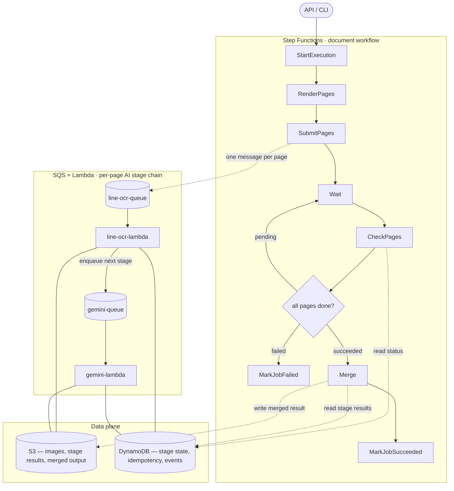

# Lady Glass
Lady Glass is a cloud OCR pipeline written in Go.

## Why Lady Glass
I met a Hong Kong woman in Kuala Lumpur who wore distinctive glasses.

After spending more than I should have, I later found myself reading PDFs, receipts, and card statements more carefully than usual.

At some point, I realized this was a job for AI, not for me. 

Lady Glass is a pair of glasses for documents — Her name was Miu.

## Architecture

Step Functions owns the document workflow. SQS and Lambda own the per-page AI stage chain. They meet at DynamoDB (control plane) and S3 (data plane).

| Layer            | Owns                                                                  |
| ---------------- | --------------------------------------------------------------------- |
| Step Functions   | Per-document workflow: start, render, submit, wait, check, merge      |
| SQS + Lambda     | Per-page AI stage chain: one queue + one Lambda per stage             |
| DynamoDB         | Stage state, idempotency keys, events — the control plane             |
| S3               | Page images, stage results, merged output — the data plane            |

### Why split this way

- **AI providers have different bottlenecks.** LINE OCR and Gemini live behind separate queues so each Lambda can set its own reserved concurrency (e.g. 2 vs 10) without one stage starving the other.
- **Idempotency belongs at the stage level.** `job_id + page + stage + version` is the key. A redelivered SQS message, a Lambda retry, or a Step Functions re-execution all collapse to the same "succeeded → skip" path in DynamoDB.
- **Step Functions does not chain AI steps.** Page-level retry and ack stay inside SQS so workflow state transitions don't multiply with page count, and so external API limits don't leak into the workflow.
- **CheckPages is read-only.** It polls DynamoDB and either keeps waiting, merges, or fails the job. No work happens inside the workflow itself beyond orchestration.
